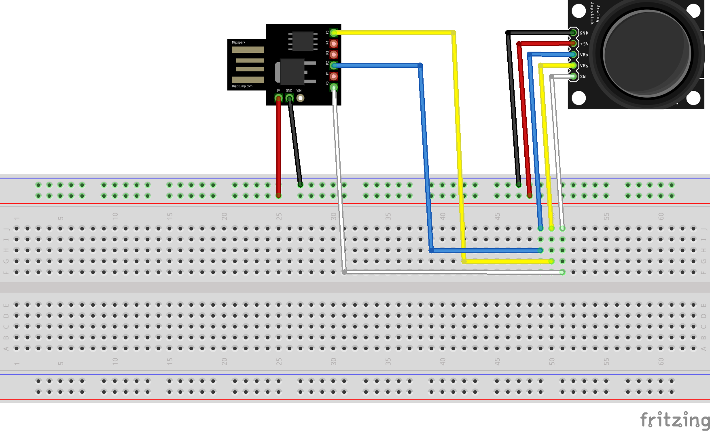
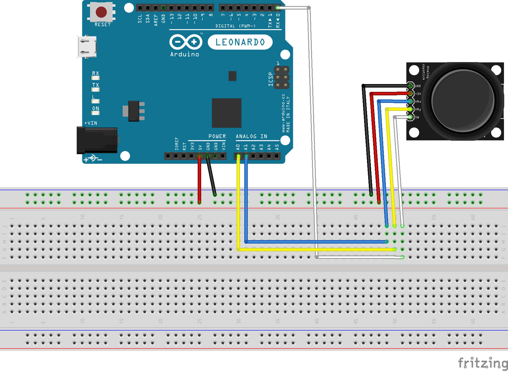

# CameraStick
Use Digispark and a Joystick (e.g KY-023) as a CameraStick

For pinout check: https://neonaut.neocities.org/blog/2018/digispark-attiny85.html

It seems that we cannot use PIN 3 and 4 if we want to use USB.

Because we need two analog inputs for X and Y we have to enable PIN 5 (by default a reset PIN in my model).

I've used this pages to enabled PIN 5 as IO PIN:
- https://wolles-elektronikkiste.de/digispark-die-bequeme-attiny85-alternative
- https://digistump.com/wiki/digispark/tutorials/programming

There was no need to install WinAVR because Arduino IDE has also included avrdude
```
/Applications/Arduino.app/Contents/Java/hardware/tools/avr/bin/avrdude -C /Applications/Arduino.app/Contents/Java/hardware/tools/avr/etc/avrdude.conf -v -p attiny85 -c avrisp -P /dev/cu.usbmodem14201 -b 19200 -n   
/Applications/Arduino.app/Contents/Java/hardware/tools/avr/bin/avrdude -C /Applications/Arduino.app/Contents/Java/hardware/tools/avr/etc/avrdude.conf -v -p attiny85 -c avrisp -P /dev/cu.usbmodem14201 -b 19200 -U hfuse:w:0x5F:m
```

HINT: according to [this page](http://cool-web.de/arduino/tastatur-scrollrad-mit-digispark-usb-entwicklungsboard.htm) you can also use a 100 kOhm resistor instead of chaging the fuses but I havn't tried it.

# wiring diagram


while developing I'm using a leonardo.


# TODO
- test with Euro Truck Simulator 2
